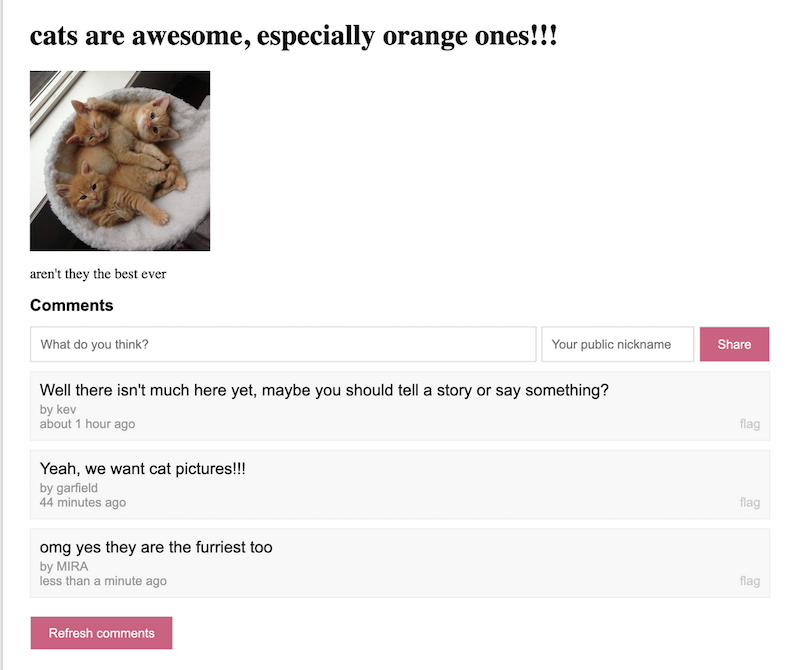
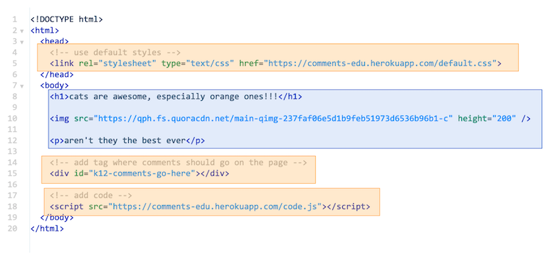

# comments-edu
For including comments in student projects, restricted to district logins only.

Slides: [comments-edu: Adding commenting to CS projects](https://docs.google.com/presentation/d/1ll3FBlOXE_6yUnmxUHnVyDp6QdpTNGEFX61opPhOYgQ/edit)

<div>
  
  
</div>

## Start locallly

```
NODE_ENV=development \
ALLOWED_GOOGLE_DOMAINS=foo.whatever.edu \
CORS_ALLOW_ORIGIN=bar.app.com \
GOOGLE_CLIENT_ID=xyz \
yarn start
```

## Provision database

Make a Postgres database, with tables:
```
# CREATE DATABASE "comments-edu";
# \c "comments-edu";

# CREATE TABLE comments (
  id serial primary key,
  thread_id text,
  comment_text text,
  by_text text,
  timestampz timestamptz
);

# CREATE TABLE flags (
  id serial primary key,
  thread_id text,
  comment_id integer,
  location text,
  html text,
  timestampz timestamptz
);
```

## Use UI library
See `public/dev.html`, and note that config is different for dev and production.


## Configure for Google
- See https://developers.google.com/identity/sign-in/web/sign-in
- Make a project, then create the set up for sign in (an OAuth client and a Web client).
- In the API Console > Credentials...
- In the OAuth consent screen, add to "authorized domain"
- Grant "authorized from javascript"

Then update the config for CORS headers and the Google verification in the app itself.

## Developing locally
Use `serve` and `ngrok` to make new code available at a public URL, then update the code.org project to point to it, and iterate away.